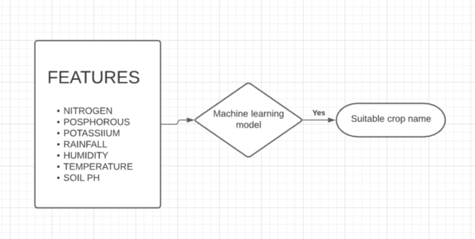
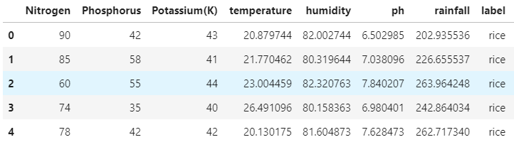
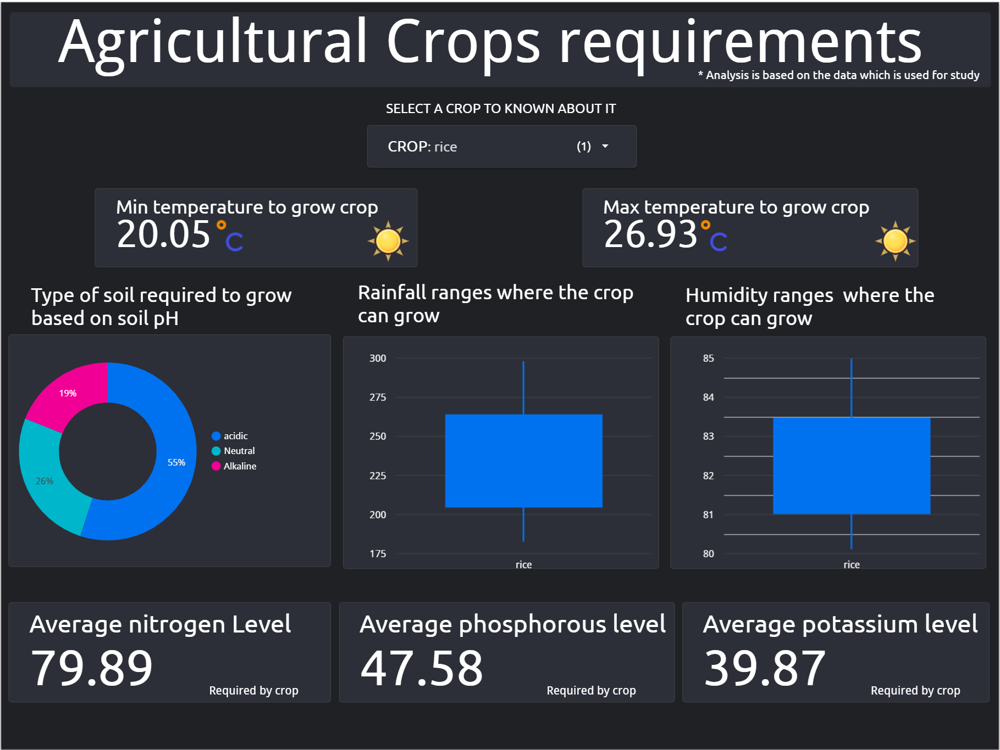

# Crop Recommendation model:

## Problem:
- The common problem existing among the Indian farmers is they don’t choose the right crop based on their soil requirements. Due to this, they face a serious setback in crop yeild. if they can choose the right crop for the cultivation based on soil and environmental factors yield of the crop will be increases and farmers can get better profits. As shown in the below flowchart by fitting the features or the soil composition values into machine learning model you have to get the suitable crop for the famer's that can increase their crop yeild. 

- 

## Aim:
- The main aim of the project is to analyze the main features to predict the crop and help farmer's in predicting the right crop for their land.

## Data:

- Data has been taken from the [Kaggel Crop Recomendation Data](https://www.kaggle.com/atharvaingle/crop-recommendation-dataset)
-  This data contains 7 features 
   - `Nitrogen` - ratio of Nitrogen content in soil.
   - `Phosphorous` - ratio of Phosphorous content in soil.
   - `Potassium` - ratio of Potassium content in soil.
   - `temperature` - temperature in degree Celsius.
   - `humidity` - relative humidity in %.
   - `ph` - ph value of the soil.
   - `rainfall` - rainfall in mm.
- Overview of the data
  

## Data cleaning:
- checking outiers for each feature class level and there are no outliers present in the data.
- Added Type_of_soil column based on the ph values for analysis purpose.
- Cheking for null values and there are no null values or missing values in the data.

## Data Anlaysis:
- Data analysis has been done for each fetures and created a dasboard in google data studios. [Click here to check intractive dashboard](https://datastudio.google.com/reporting/2129d913-26cf-43c3-80a7-ba00fd62ce79/page/Ivx)

## Model building
- Decision tree has been used for this data.Because their outputs are easy to read and interpret, without even requiring statistical knowledge. For example, when using decision trees to this crop recomendation data, the farmers can read and interpret the graphical representation of the data without requiring statistical knowledge and they can see and interpert on what basis the crop is selected.

- Problem with most of the Decision tress are they tends to overfit easily. Hyper parmeter tunning has been done to overcome this problem.

- With an accuracy of 99%, the model can able to predict the right crop based on the soil composition and weather conditions of the agricultural land.

