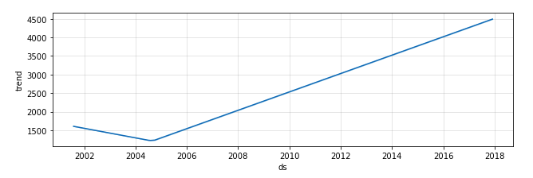
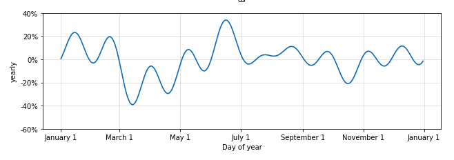
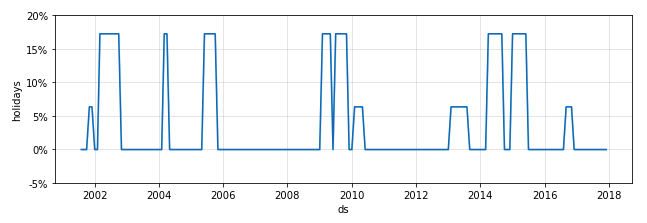

# Crop's Price Forecasting:

## Problem:
- To forcast the price of te crops that are recommended by the [Crop Prediction model](https://github.com/mohansaimandalapu/Famers-Amigo/tree/main/Crop_Identification) for the time period that is same as the predicted crops growing period so that farmwes can know the futer price of the crop before sawing of the crop.

## Data:
- Data has been collected from the [Agmarket, government website](https://agmarknet.gov.in/). From this website data for Banglore's(Banglore market) prices of Rice and Maize has been taken for the project.

## Data cleaning:
  - Removing outliers that are 1.5 standared deviation away from the data.
  - grouping data into month level.
  - Filling missing values to previous month values using forward filling.
  - Kepping required columns and droping unnessary columns.

## Model building:
 -  ### Facebook Prophet:

    - For this project facebook prophet has been used

    - Facebook prophet at its core is the sum of three functions of time plus an error term: growthg(t), seasonality s(t), holidays h(t) , and error e_t.
    
      
    
      ### Growth g(t) :
      - Growt in facebook prophet can be liner growth model or logistic growth model.
      - <b>Logistic growth</b> - The initial stage of growth is approximately exponential , as saturation begins, the growth slows to linear and at maturity, growth stops.
      - <b>Linear growth</b> - Linear growth has the characteristic of growing by the same amount in each unit of time. A quantity grows linearly if it grows by a constant amount for each unit of time.
      - In case of rice crop price forcasting growth is linear as shown in the below figure.
         
      ### Seasonality s(t):
      - In time series data, seasonality is the presence of variations that occur at specific regular intervals less than a year, such as weekly, monthly, or quarterly. Seasonality may be caused by various factors, such as weather, vacation, and holidays etc.
      - In the below figure you can see the seasonality in the price of Rice crop.
         
      ### Holidays h(t):
      - Trend ans seasonality can be automatically find by the model, but Holidays or the special events that we have to add manually.
      - For forcasting of the price of rice Holidays or the special events are dates when the floods and droughts are occured. Because The main factor's thats decide the price of the crops are Supply and Demand. Supply of the crops may varies because of various resons like floos, Droughts and whether change so this are the special events that are to be added to the model.
      - Effects of an holidays for the rice price shown in below figure.
        

  - Facebook's Prophet has been forcasting the price of the Rice and Maize crops with an Mean Absoult Error of 300 RS.
