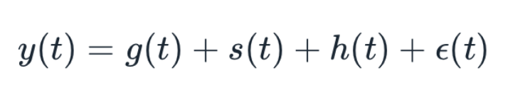

# Crop's Price Forecasting:

## Problem:
- Farmer's while they are sawing crop they don't know what would be the price of that crop while they are harvesting. Price may go upwards or downwards. If they can able to know the price before they can choose the crops that will give more profit. In this project, you can see the forecasting price of the crop and The forecast period is the same as the selected crops growing period. 

## Aim:
- To forecast the price of the crop that recommended by the [Crop Prediction model](https://github.com/mohansaimandalapu/Famers-Amigo/tree/main/Crop_Identification).

## Data:
- Data has been collected from the [Agmarket, government website](https://agmarknet.gov.in/). From this website data for Banglore's(Banglore market) prices of Rice and Maize has been taken for the project.

## Data cleaning:
  - Removing outliers that are 1.5 standared deviation away from the data.
  - grouping data into month level.
  - Filling missing values to previous month values using forward filling.
  - Kepping required columns and droping unnessary columns.

## Model building:
- Fcebook's Prophet has been used to forcast the price of the crops.
- Facebook prophet at its core is the sum of three functions of time plus an error term: growthg(t), seasonality s(t), holidays h(t) , and error e_t.

- Growth and sesonality will be automatically learnt by model itself, But Holidays or special events that you have to add to model manually.
- The main factor's thats decide the price of the crops are Supply and Demand. Supply of the crops may varies because of various resons like floos, Droughts and whether change so this are the special events that are to be added to the model.
- So for the karnataka district time periods of floods and droughts are collected and passed to the model as special events or holidays.
- Facebook's Prophet has been forcasting the price of the Rice and Maize crops with an Mean Absoult Error of 300RS.
